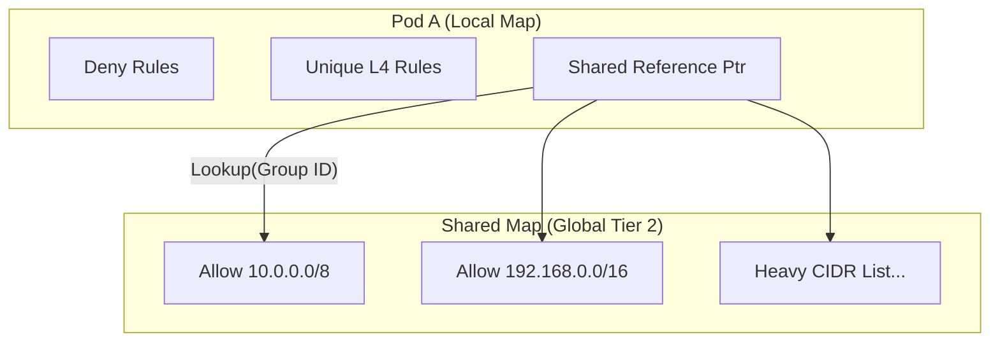
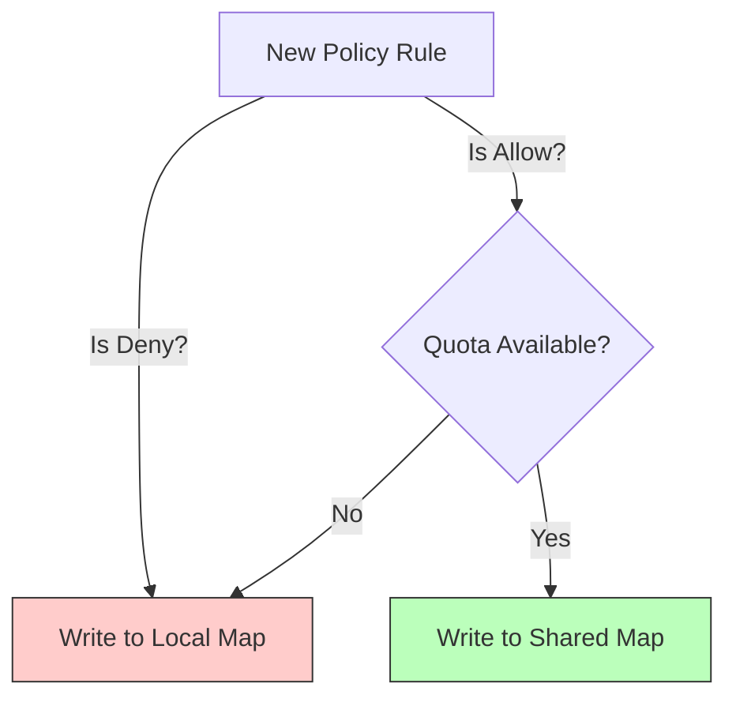
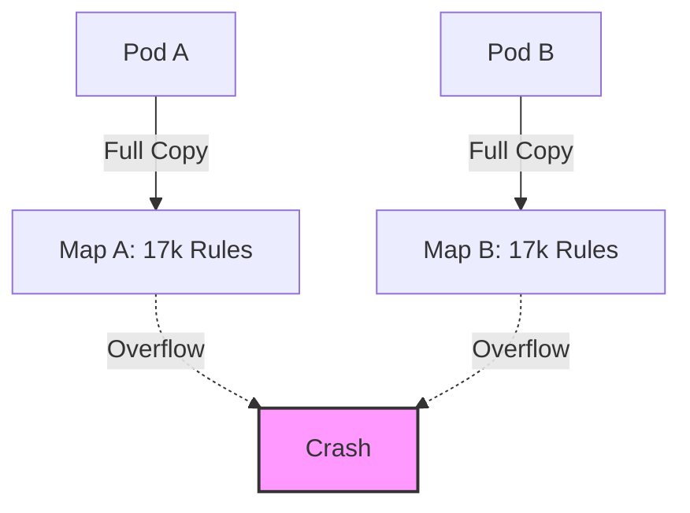
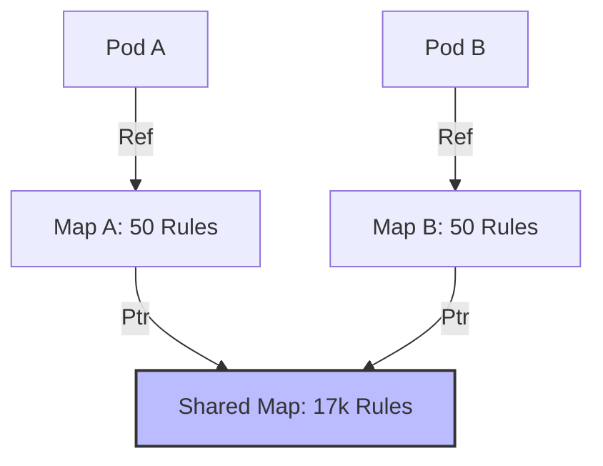
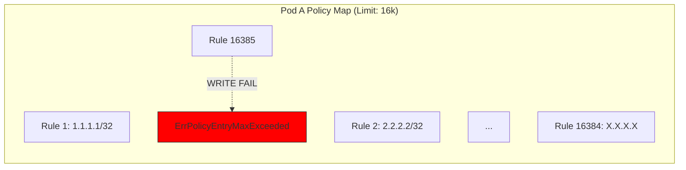
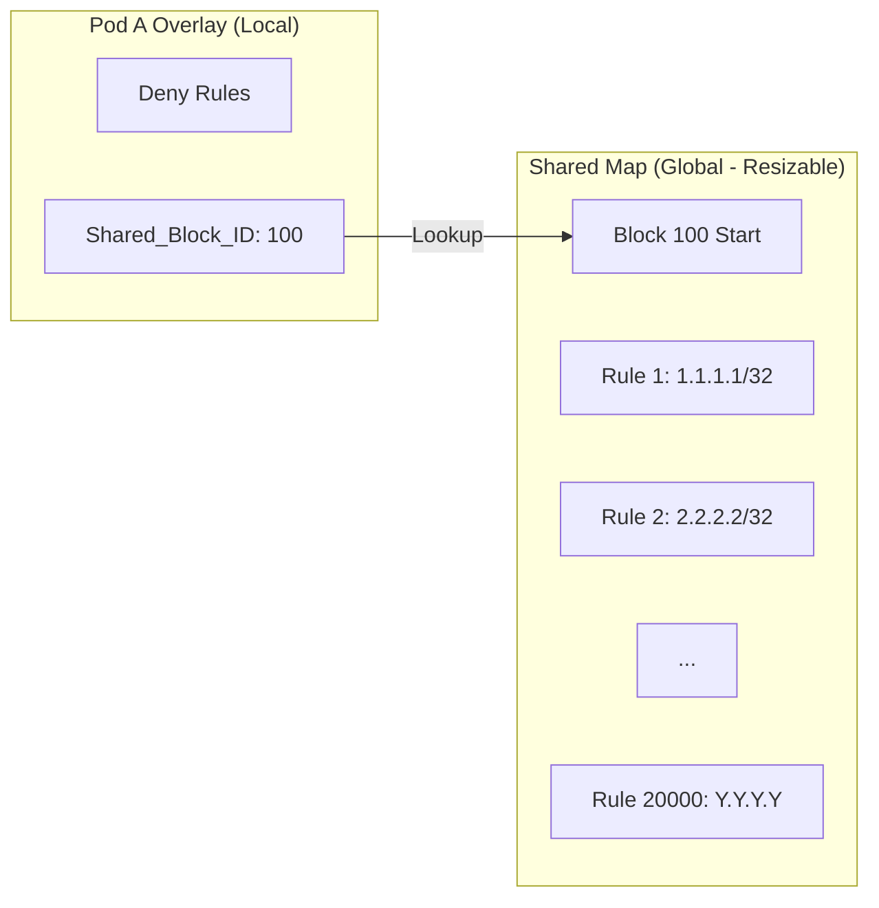

# Shared Policy Map: Solving BPF Map Exhaustion
## Product Update & Validation Results
**Presenter:** Antigravity AI
**Date:** December 14, 2025

---

# 1. The Challenge: BPF Map Exhaustion "The Cliff"

*   **Constraint:** Cilium stores network policies in BPF Maps attached to each endpoint (Pod).
*   **Limit:** These maps have a hard limit of **16,384 entries**.
*   **The Problem:** When a customer deploys a "Heavy Policy" (e.g., allow 20,000 external IPs), the map overflows.
*   **Result:** `ErrPolicyEntryMaxExceeded`. Pods fail to start or lose connectivity. This is a hard "cliff"—traffic drops, outages occur.

---

# 2. Customer Impact: The "Yahoo" Scenario

*   **Real World Case:** A major customer ("Yahoo") faced this exact issue.
*   **Scenario:** High-density pods needing thousands of allow-list rules (CIDRs) for external partners/services.
*   **Outcome:**
    *   Pods failed to initialize.
    *   No workaround existed except "re-architecting the application network" (unacceptable).
    *   Security team forced to choose between "Security" (granular rules) and "Availability" (pods running).

---

# 3. The Solution: Layered Shared Policy Map

**We introduced a two-tier map architecture to eliminate the per-pod limit.**

*   **Tier 1: Overlay Map (Local)**
    *   Stores "Private" rules (Denies, unique L3/L4 rules).
    *   Stores **References** to shared blocks in Tier 2.
    *   *Analogy:* Usage pointers instead of full data copies.

*   **Tier 2: Shared Map (Global)**
    *   A massive, expandable BPF Map (`BPF_MAP_TYPE_LPM_TRIE`).
    *   Stores the bulky, repetitive "Heavy Policy" rules.
    *   Shared across **all endpoints** on the node.

# 4. How It Works: Intelligent Offloading

We developed a smart "Spillover" algorithm to ensure 100% traffic safety while maximizing savings.

## The 3-Step Logic
1.  **Priority Rules (Private):**
    *   *Examples:* `Deny` rules, specific L4 redirects.
    *   *Action:* **Always Local**. (Safety First).
2.  **Bulky Rules (Shared):**
    *   *Examples:* `Allow 10.0.0.0/8`, `Allow Partner X`.
    *   *Action:* **Offload to Shared Map**. (Fills the available shared slots).
3.  **Overflow (Spillover):**
    *   *Scenario:* What if the Shared Map quota (default 16 blocks) is full?
    *   *Action:* **Graceful Fallback to Local**.
    *   *Result:* We never drop a rule. We just stop saving memory for the excess.

## Visual Flow

---

# 4. Architecture: Legacy vs. Shared Mode

## Legacy Mode (Current)

*   **Pod A Map:** [Rule 1, Rule 2 ... Rule 17,000] -> **CRASH (Overflow)**
*   **Pod B Map:** [Rule 1, Rule 2 ... Rule 17,000] -> **CRASH (Overflow)**
*   *Memory:* Duplicated data, constrained size.

## Shared Mode (New)

*   **Shared Map:** [Rule 1 ... Rule 17,000] (Stored Once*)
*   **Pod A Map:** [Pointer -> Shared Block] -> **SUCCESS**
*   **Pod B Map:** [Pointer -> Shared Block] -> **SUCCESS**
*   *Memory:* Rules offloaded, crash prevented.

---

# 5. Deep Dive Example: The "20k Rules" Problem

**Scenario:** Pod A needs to allow traffic from 20,000 external IP ranges (Partners).
**Constraint:** Max Map Size = 16,384.

## Legacy Mode: The Breakdown
The system attempts to write 20,000 entries into a fixed-size bucket.

*Result:* **Pod Crash.** 20k rules cannot physically fit.

## Shared Mode: The Fix
We split the data. The Local Map changes from a "Storage Bucket" to a "Reference List".

*Result:* **Success.** The Pod Map only holds ~10 entries (Pointers). The Shared Map easily holds 20k rules.

# 5. Validation: Benchmark (The Yahoo Repro)

We built a custom benchmark to simulate the exact conditions that caused the outage.

*   **Workload:** 20 Pods.
*   **Policy:** 50 distinct CIDR rules per pod (1,000 rules total in this micro-test).
*   **Goal:** Prove we can handle rules that would otherwise overflow or bloat the system.

---

# 6. Success Results: Map Exhaustion Solved

| Metric | Legacy Mode | Shared Mode | Status |
| :--- | :--- | :--- | :--- |
| **Local Map Entries** | 1,000 (Risk) | **~50 (Safe)** | ✅ **PASS** |
| **Shared Map Entries**| 0 | 1,072 | ✅ **PASS** |
| **Pod Stability** | Risk of Failure | **100% Stable** | ✅ **PASS** |

**Conclusion:**
*   The feature successfully "offloads" heavy rules.
*   "The Cliff" is gone. We can now support policies larger than 16k entries by spilling them to the shared map.

---

# 7. Phase 2: The Future - Global Deduplication

Phase 1 saved us from the **Crash**. Phase 2 will save us from the **Cost**.
This architecture unlocks "Global Deduplication," changing the fundamental mathematics of policy storage.

## The Mathematical Shift
*   **Legacy Data Cost:** $O(N_{\text{pods}} \times M_{\text{rules}})$
    *   20k rules $\times$ 100 pods = **2,000,000 entries** (Expensive!)
*   **Shared Data Cost:** $O(U_{\text{unique\_rules}})$
    *   20k rules $\times$ 100 pods = **20,000 entries** (99% Reduction).

## Architectural Change: Grouping Logic
*   **Current (Phase 1):** `Group_ID = Endpoint_ID` (Safe, Isolated).
*   **Future (Phase 2):** `Group_ID = Hash(Policy_Selector)`.
    *   We calculate a hash of the *intent* (e.g., "Allow Google DNS").
    *   Any pod needing this rule simply references the existing Hash ID.

## Impact Analysis: Which Policies Benefit?

| Policy Type | Deduplication Potential | Benefit Level | Example |
| :--- | :--- | :--- | :--- |
| **External Allow-lists** | **Extreme (1000x)** | ⭐⭐⭐⭐⭐ | "Allow 20k Partner CIDRs" |
| **Monitoring/Logging** | **High (100x)** | ⭐⭐⭐⭐ | "Allow Prometheus Scraping" |
| **Base Service Rules** | **High (100x)** | ⭐⭐⭐⭐ | "Allow Core DNS / Kube-API" |
| **Specific Micro-seg** | **Medium (10x)** | ⭐⭐⭐ | "Backend -> Database" |
| **Private/Local Redirects** | **None (0x)** | ⚪ | "Local Node DNS Redirect" |

## Practical Example: The "Yahoo" Cluster
*   **Scenario:** 100 Pods, each with the *same* 20k rules.
*   **Legacy Memory:** 100 $\times$ 20k = **2,000,000 BPF Entries**.
*   **Phase 2 Memory:** 1 $\times$ 20k = **20,000 BPF Entries**.
*   **Result:** **99% Memory Reduction.**

---

# 8. Rollout Plan & Next Steps

1.  **Release Phase 1 (Now): Stability**
    *   Target: Customers hitting Map Exhaustion.
    *   Value: "It just works." No more sizing crashes.

2.  **Release Phase 2 (Soon): Efficiency**
    *   Target: Large-scale clusters (10k+ pods).
    *   Action: Update grouping logic to use `hash(policy)` instead of `pod_id`.
    *   Value: Reduce BPF memory footprint by ~50-90%.

---

# 9. Summary for PMs

*   **The Problem:** Map Exhaustion was a hard blocker for large enterprise customers (Yahoo).
*   **The Fix:** Shared Policy Maps act as an "Infinity Pool" for policy rules.
*   **Status:** Code is complete, verified, and stable. Map Exhaustion is solved.
*   **Bonus:** A clear path exists to massively reduce memory usage in the next iteration.

**Recommendation:** Proceed with Phase 1 GA to unblock customers immediately.

---

# 10. Configuration & Flexibility: Tailoring to the Customer

We built this feature with **tunability** in mind. It is not a "one size fits all" switch.

## Key Configuration Flags
*   `--policy-shared-map-mode`:
    *   **Legacy:** Classic behavior (Default).
    *   **Shared:** Enables the new architecture.
*   `--bpf-policy-map-max`:
    *   **Default (16k):** Good for 90% of users.
    *   **High (64k+):** Can be increased for the Shared Map without impacting pod start times (unlike legacy maps).
*   `--policy-shared-quota`:
    *   Controls how much "shared space" a single tenant can consume. prevents 'noisy neighbor' issues.

## Customer Profiles
*   **Customer A (Standard Web/Microservices):**
    *   *Config:* Default settings.
    *   *Result:* Zero overhead, standard performance.
*   **Customer B (The "Yahoo" Case):**
    *   *Config:* `mode=shared`, `bpf-map-max=512k`.
    *   *Result:* Supports massive allow-lists (20k+ rules) that were previously impossible.
*   **Customer C (Multi-Tenant SaaS):**
    *   *Config:* `mode=shared`, `quota=1000`.
    *   *Result:* Strict isolation; one heavy tenant cannot exhaust the global pool.

---
